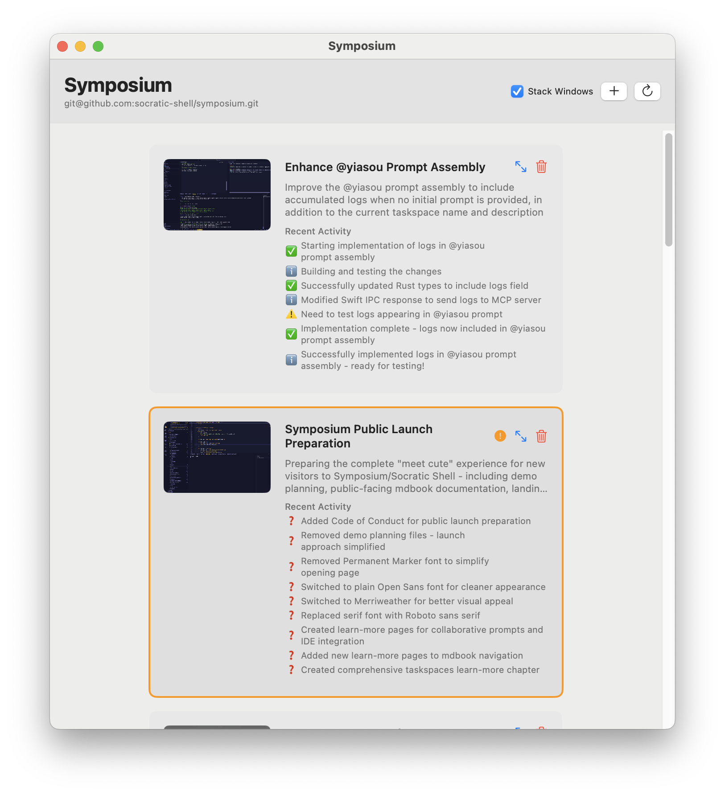

# Taskspaces

*Taskspaces* are a way to orchestrate multiple agents working on different copies of your code. They are supported via the Symposium OS X application:

Currently, taskspaces are all stored on your local machine and agents run synchronously -- i.e., when your editor is not active, the agent is also not active. But we would like to support remote development (e.g., cloud-hosted or via ssh) and persistent agents (see the {RFD:persistent-agents} RFD).

## How to use them

Launch the Desktop app. Create a new project and give it the URL of your git repository. This will clone your git repository.

### Granting permissions

The Desktop app is designed to work with any editor. It does this by using the Mac OS X Accessibility APIs to move windows from the outside and screen capture APIs to capture screenshots. You need to grand these permissions.

### Creating taskspaces

Create your first taskspace with the "+" button. VSCode will launch and open up the agent.

Once in the taskspace, you can spawn a new taskspace by telling the agent to "spawn a new taskspace" and describing the task you would like to perform in that space.

### Taskspace logs and signals

The agent has accept to MCP tools to [report logs and signal for your attention](../design/mcp-tools/taskspace-orchestration.md). Logs reported in this way will show up in the Desktop app.

### Stacked windows

If you check the "Stack Windows" button, then all of your editor windows will be arranged into a stack so that only one is visible at any time. When you click on a taskspace, it will be brought to the top of the stack. When you drag or resize windows, the others in the stack will follow behind.

### Activating and deactivating a taskspace

When you close the window for your editor, the taskspace will be "deactivated". This currently means that the agent is halted.

When you click a deactivated taskspace, the window will re-open and the agent will be reinvoked and asked to resume your conversation.

### Deleting taskspaces

You can delete a taskspace with the trashcan button or by asking the agent to "delete this taskspace".

## How it is implemented

The Desktop app is [written in Swift](../design/implementation-overview.md). You will find documentation on in the [Symposium application specifics](../design/symposium-app-specifics.md) section.